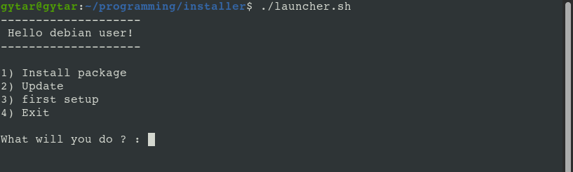

# Linux Intaller of software cross platform



- allows to install any program that you want depending on your distro
- careful, this is not a program to fall into the wrong hands ! uses sudo alot

**To run this program:** This is plug 'n' play.

```bash
  cd /path/to/installer
  chmod a+x launcher.sh
  ./launcher.sh
```

There you go, hope you enjoy :)

## TODO :

- Do the same as apt for dnf / yum / pacman etc.
- Add theme coverage (if needed)
- Remove install package and update ?

> :warning: This is a beta, and bugs can occur, you can send me a message and fork if you can debug what you found

Author: Gytar
